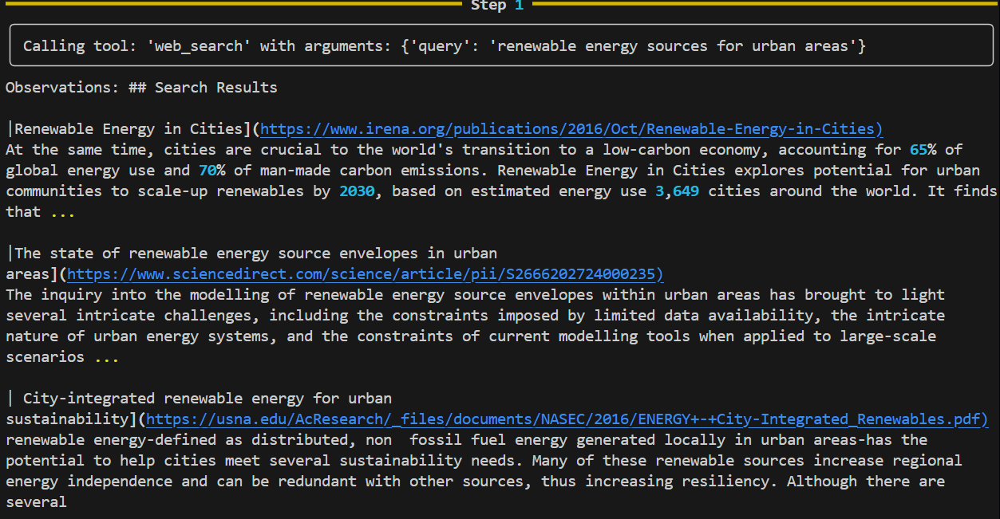
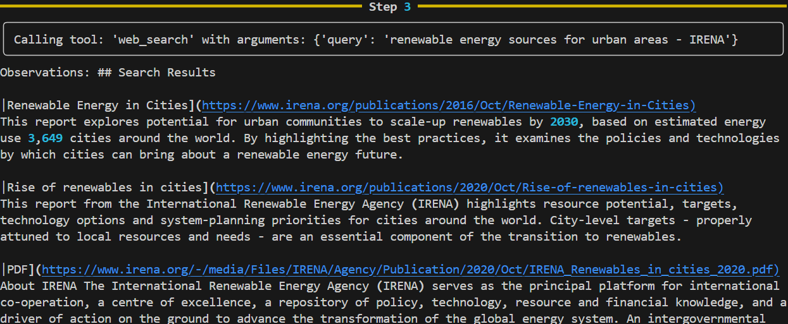
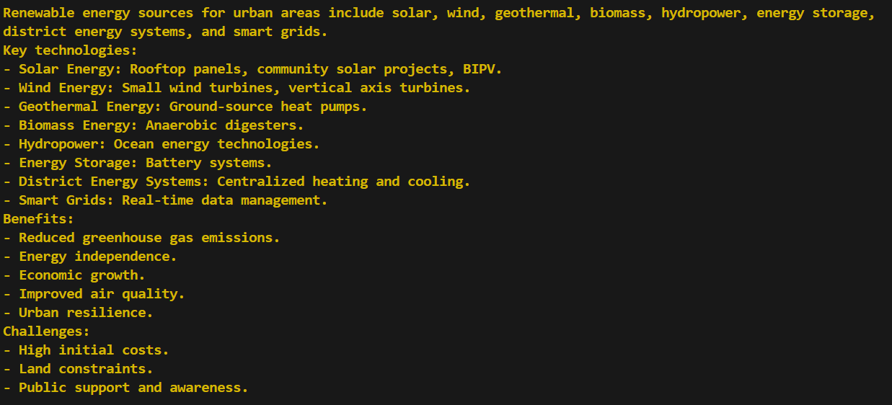
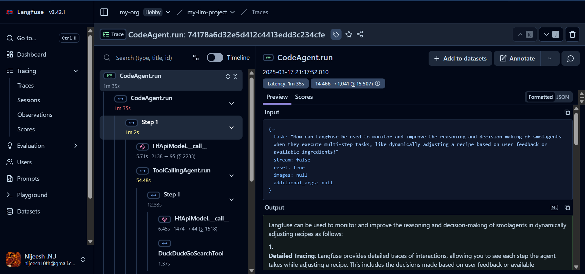

# Agentic Research

### Develop an AI agent using SmolAgent Framework that uses ReAct(Reason - Act) feedback system with deep research capabilities that can be easily used by users to tackle real world problems in a faster method.

## Langfuse-Powered Smolagents with Hugging Face

### Overview

This project integrates [Langfuse](https://langfuse.com/) with [Smolagents](https://github.com/smol-ai/smolagents) to monitor and improve reasoning and decision-making capabilities when executing multi-step tasks. By utilizing OpenTelemetry tracing and AI models from Hugging Face, this implementation allows real-time performance tracking and optimization of autonomous agents.

### Features

- **Langfuse Integration**: Observability with OpenTelemetry.
- **Hugging Face AI Model**: Uses `Qwen/Qwen2.5-Coder-32B-Instruct`.
- **Multi-Agent System**: Implements `CodeAgent` and `ToolCallingAgent`.
- **Web Search & Data Retrieval**: DuckDuckGo and Webpage visiting tools.
- **Replay Functionality**: Allows re-execution of previous runs.

### Demo

